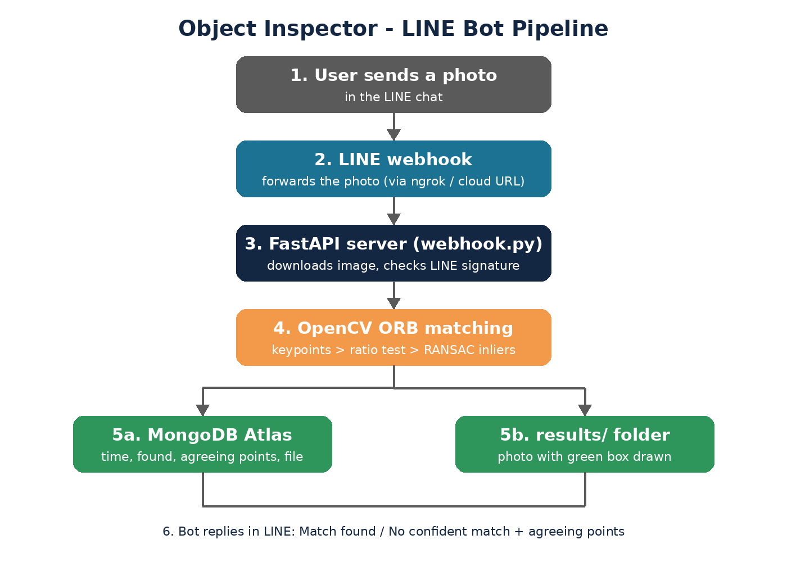
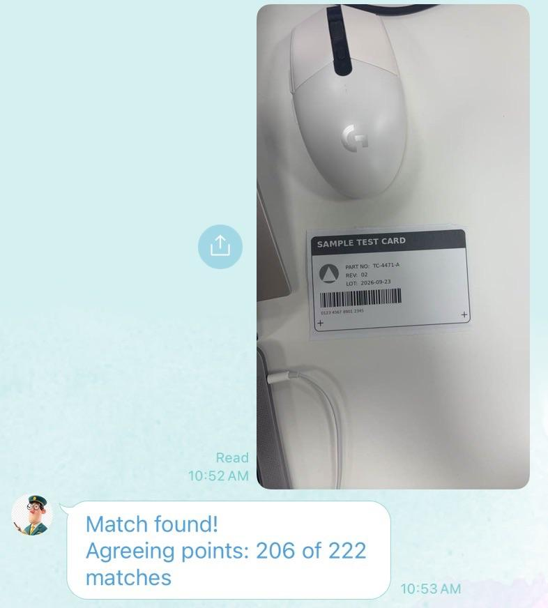
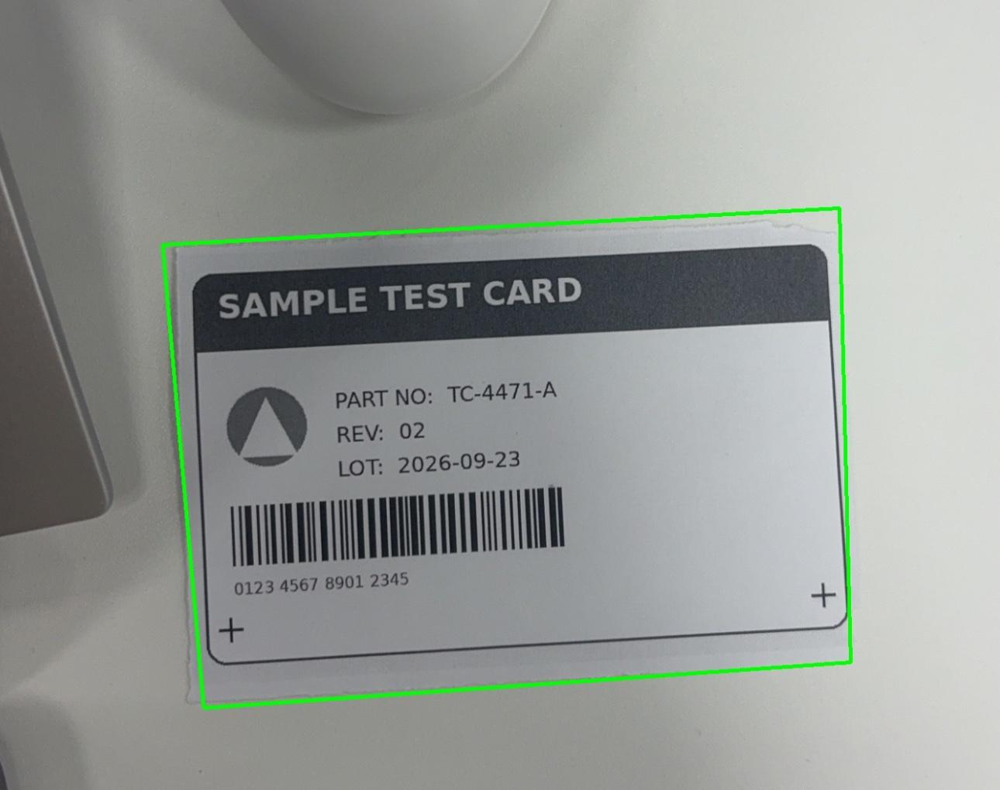
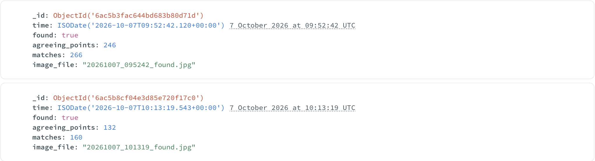

# Object Inspector: LINE Bot Image Inspection

Send a photo to a LINE bot. The bot checks whether a reference label is in the photo, draws a box around it, logs the result to MongoDB, and replies with the answer.

Built with Python, FastAPI, OpenCV, MongoDB Atlas and the LINE Messaging API. This is a portfolio project, built to learn how to put image analysis behind a chat interface.



## How it works

1. A user sends a photo to the LINE bot.
2. LINE calls the FastAPI webhook (`webhook.py`), which checks the LINE signature and downloads the image.
3. OpenCV finds ORB keypoints in the reference label and in the photo, and matches them (Lowe ratio test, 0.75).
4. RANSAC fits a homography to the matches. The matches that agree with it are the "agreeing points".
5. The label counts as found when there are **at least 15 agreeing points and at least 50% of the good matches agree**.
6. A copy of the photo with the detected box drawn is saved, the result (time, found, agreeing points, matches, image file) is stored in MongoDB, and the bot replies in LINE.

This is classic computer vision (feature matching), not machine learning.

## Results

| Test | Result |
|---|---|
| Label rotated 90° | Found. 246 of 266 matches agree |
| Second photo | Found. 206 of 222 matches agree |
| Unrelated labelled object | Rejected. 5 of 18 |

<p>


</p>

Each result is logged in MongoDB Atlas:



## What went wrong, and what I changed

- **Keyboard photo:** a high match count but a wrong box. The repeating keys match each other, so the count alone is not enough. I added the drawn box so the result can be checked by eye, and the 50% agreement rule.
- **Oversized box:** the first template included the table around the label. I cropped the template to the label only (`template_card.jpg`).
- **Still fails:** small, distant or glossy objects. The label needs to fill roughly a quarter of the frame.

## Run it locally

Requires Python 3.12 (3.14 tried to build OpenCV from source on my Mac).

```bash
python3.12 -m venv venv
source venv/bin/activate
pip install -r requirements.txt
```

Create a `.env` file (never commit it):

```
LINE_CHANNEL_ACCESS_TOKEN=...
LINE_CHANNEL_SECRET=...
MONGODB_URI=...
```

Start the server and expose it with ngrok:

```bash
uvicorn webhook:app --port 8000
ngrok http 8000
```

Set the ngrok URL plus `/callback` (use the route defined in `webhook.py`) as the webhook URL in the LINE Developers console.

## Files

| File | Purpose |
|---|---|
| `webhook.py` | FastAPI webhook, LINE reply, matching rule, MongoDB logging |
| `match.py` | Standalone ORB + RANSAC matching on two images |
| `keypoints.py` | Draws keypoints, used to see what the matcher sees |
| `template_card.jpg` | Reference label |

## Limits and next steps

- Runs locally behind an ngrok tunnel. It is not deployed yet.
- Next: read the label text with OCR and pass it to an LLM.
- Next: deploy to a cloud host so the bot runs without my laptop.
